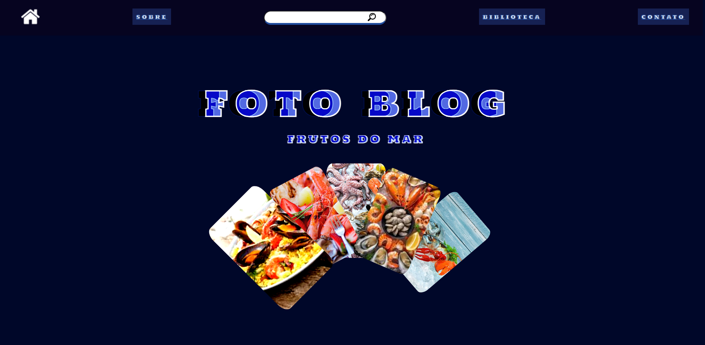

Nesse projeto eu utilizei html, css e javascript para a criação do meu site.

Mesmo não estando da forma mais otimizada possível, eu aprendi muito sobre javascript, htmlm e css. e nos proximos projetos pretendo utilizar o que eu aprendi e fazer projetos cada vez melhores, mais bonitos e com mais funcionalidades.